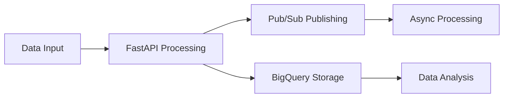
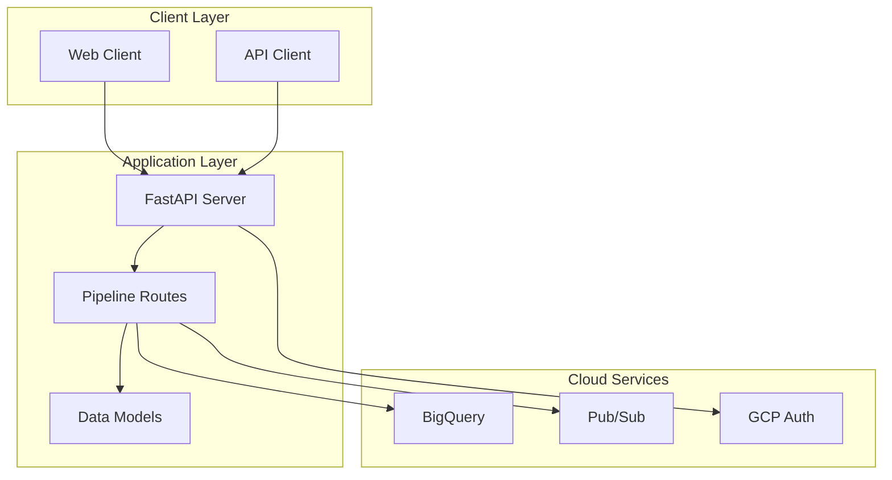

# CloudDataForge

<div align="center">


**A modern, scalable data engineering platform built with FastAPI for cloud-native ETL operations and data processing workflows.**

[Documentation](#documentation) • [Quick Start](#quick-start) • [Configuration](#configuration) • [API Reference](#api-reference)

</div>

---

## Features

- **FastAPI-powered REST API** for data pipeline management
- **Cloud-native architecture** supporting GCP, AWS, and Azure
- **Modular ETL services** for data ingestion, processing, and storage
- **Scalable microservices** design for enterprise workloads
- **Comprehensive testing** with pytest framework
- **Docker containerization** for easy deployment
- **Environment-based configuration** management
- **BigQuery integration** with automatic table creation
- **Pub/Sub messaging** for asynchronous processing
- **Query utilities** for data analysis

## Architecture

```
CloudDataForge/
│
├── app/                          # Main application package
│   ├── main.py                  # FastAPI application entrypoint
│   ├── models/                  # Data models
│   │   └── data_model.py       # Pydantic models for API
│   ├── routes/                  # API route definitions
│   │   └── pipelines.py        # Pipeline processing endpoints
│   ├── services/                # Business logic and ETL operations
│   │   └── gcp_service.py      # Google Cloud Platform services
│   └── utils/                   # Helper utilities
│       ├── setup_bigquery_bulk.py # BigQuery table setup utility
│       └── query_bigquery.py   # BigQuery query utility
│
├── tests/                       # Test suite
│   └── test_routes.py          # API endpoint tests
│
├── Dockerfile                  # Container configuration
├── requirements.txt            # Python dependencies
├── .gitignore                  # Git ignore patterns
├── .env.example                # Environment variables template
└── README.md                   # Project documentation
```

## Technology Stack

| Category | Technology | Version |
|----------|------------|---------|
| **Backend** | FastAPI | 0.104+ |
| **Database** | Google BigQuery | Latest |
| **Messaging** | Google Pub/Sub | Latest |
| **Environment** | python-dotenv | 1.0+ |
| **Testing** | pytest | 7.4+ |
| **Containerization** | Docker | Latest |
| **Cloud** | Google Cloud Platform | Latest |

## Prerequisites

- Python 3.8 or higher
- Docker (for containerized deployment)
- Google Cloud Platform account
- GCP Service Account with BigQuery and Pub/Sub permissions
- pip or poetry for dependency management

## Quick Start

### Docker (Recommended)

1. **Clone the repository**
   ```bash
   git clone https://github.com/yourusername/CloudDataForge.git
   cd CloudDataForge
   ```

2. **Configure environment variables**
   ```bash
   cp .env.example .env
   # Edit .env with your GCP credentials and project details
   ```

3. **Run with Docker Compose**
   ```bash
   # Production mode
   docker-compose up -d
   
   # Development mode with hot reload
   docker-compose -f docker-compose.dev.yml up -d
   ```

4. **Access the application**
   - API: http://localhost:8000
   - Documentation: http://localhost:8000/docs
   - Health Check: http://localhost:8000/

### Local Development

1. **Clone the repository**
   ```bash
   git clone https://github.com/yourusername/CloudDataForge.git
   cd CloudDataForge
   ```

2. **Create virtual environment**
   ```bash
   python -m venv venv
   source venv/bin/activate  # On Windows: venv\Scripts\activate
   ```

3. **Install dependencies**
   ```bash
   pip install -r requirements.txt
   ```

4. **Set up environment variables**
   ```bash
   cp .env.example .env
   # Edit .env with your GCP configuration
   ```

5. **Run the application**
   ```bash
   uvicorn app.main:app --reload --host 0.0.0.0 --port 8000
   ```

### Docker Deployment

1. **Build the image**
   ```bash
   docker build -t clouddataforge .
   ```

2. **Run the container**
   ```bash
   docker run -p 8000:8000 clouddataforge
   ```

## Docker Deployment

### Production Deployment

The project includes a production-ready Docker setup with multi-stage builds, security best practices, and health checks.

#### Build and Run

```bash
# Build the Docker image
docker build -t clouddataforge:latest .

# Run with environment variables
docker run -d \
  --name clouddataforge-app \
  -p 8000:8000 \
  -e GCP_PROJECT_ID=your-project-id \
  -e GOOGLE_APPLICATION_CREDENTIALS=/app/credentials/gcp_key.json \
  -e BIGQUERY_DATASET_ID=your-dataset \
  -e BIGQUERY_TABLE_ID=your-table \
  -v $(pwd)/gcp_key.json:/app/credentials/gcp_key.json:ro \
  clouddataforge:latest
```

#### Docker Compose (Recommended)

```bash
# Production deployment
docker-compose up -d

# Development with hot reload
docker-compose -f docker-compose.dev.yml up -d

# View logs
docker-compose logs -f

# Stop services
docker-compose down
```

#### Docker Features

- **Multi-stage build** for optimized image size
- **Non-root user** for security
- **Health checks** for container monitoring
- **Volume mounts** for credentials and logs
- **Environment variable** configuration
- **Nginx reverse proxy** (optional, for production)

#### Container Management

```bash
# Check container status
docker ps

# View container logs
docker logs clouddataforge-app

# Execute commands in container
docker exec -it clouddataforge-app bash

# Stop and remove container
docker stop clouddataforge-app
docker rm clouddataforge-app
```

## Configuration

The application uses environment variables for configuration. Copy `.env.example` to `.env` and customize:

```bash
# API Configuration
API_HOST=0.0.0.0
API_PORT=8000
DEBUG=True

# Google Cloud Platform Configuration
GCP_PROJECT_ID=your-gcp-project-id
GOOGLE_APPLICATION_CREDENTIALS=path/to/your/service-account.json

# BigQuery Configuration
BIGQUERY_DATASET_ID=your-dataset-id
BIGQUERY_TABLE_ID=your-table-id

# Pub/Sub Configuration
PUBSUB_TOPIC_ID=data-topic
```

## API Reference

### Core Endpoints

| Method | Endpoint | Description |
|--------|----------|-------------|
| `GET` | `/` | Health check and project info |
| `POST` | `/pipeline/process` | Process data through ETL pipeline |

### Example API Usage

**Process Data:**
```bash
curl -X POST "http://localhost:8000/pipeline/process" \
  -H "Content-Type: application/json" \
  -d '{
    "items": [
      {"name": "user1", "value": 123.45},
      {"name": "user2", "value": 678.90}
    ]
  }'
```

**Response:**
```json
{
  "status": "success",
  "processed_count": 2,
  "pubsub_results": [
    {"status": "success", "message_id": "123456789"},
    {"status": "success", "message_id": "987654321"}
  ],
  "bigquery_errors": null
}
```

## Documentation

Once the application is running, access the interactive API documentation:

- **Swagger UI**: http://localhost:8000/docs
- **ReDoc**: http://localhost:8000/redoc
- **OpenAPI Schema**: http://localhost:8000/openapi.json

## Utilities

### BigQuery Setup

Set up your BigQuery tables and insert test data:

```bash
python app/utils/setup_bigquery_bulk.py
```

**Features:**
- Creates dataset if it doesn't exist
- Creates table with proper schema
- Inserts test data
- Uses environment variables for configuration

### BigQuery Query Utility

Query and analyze your data:

```bash
python app/utils/query_bigquery.py
```

**Features:**
- Table statistics and row counts
- Custom SQL query execution
- Data analysis and insights
- Filtered data retrieval

## Testing

Run the test suite:

```bash
# Run all tests
pytest

# Run with coverage
pytest --cov=app

# Run specific test file
pytest tests/test_routes.py
```

## Project Structure

### Core Components

- **`app/main.py`**: FastAPI application configuration and startup
- **`app/routes/pipelines.py`**: Pipeline processing endpoints
- **`app/services/gcp_service.py`**: Google Cloud Platform integration
- **`app/models/data_model.py`**: Pydantic data models

### Utility Scripts

- **`setup_bigquery_bulk.py`**: BigQuery table setup and data insertion
- **`query_bigquery.py`**: BigQuery query and analysis utility

## Usage Examples

### Data Processing Pipeline

1. **Send data to pipeline:**
   ```bash
   curl -X POST "http://localhost:8000/pipeline/process" \
     -H "Content-Type: application/json" \
     -d '{"items": [{"name": "test", "value": 100}]}'
   ```

2. **Check BigQuery data:**
   ```bash
   python app/utils/query_bigquery.py
   ```

3. **View API documentation:**
   - Visit http://localhost:8000/docs

## Contributing

1. Fork the repository
2. Create a feature branch (`git checkout -b feature/amazing-feature`)
3. Commit your changes (`git commit -m 'Add amazing feature'`)
4. Push to the branch (`git push origin feature/amazing-feature`)
5. Open a Pull Request

## License

This project is licensed under the MIT License - see the [LICENSE](LICENSE) file for details.

## Support

- **Documentation**: Check the API docs at `/docs`
- **Issues**: Report bugs and feature requests via GitHub Issues
- **Discussions**: Join community discussions in GitHub Discussions

## Roadmap

- [ ] Multi-cloud support (AWS, Azure)
- [ ] Real-time streaming capabilities
- [ ] Advanced data quality monitoring
- [ ] Workflow orchestration with Airflow
- [ ] Machine learning pipeline integration
- [ ] Performance monitoring and alerting
- [ ] Advanced authentication and authorization
- [ ] Web dashboard for data visualization

## Performance

- **Response Time**: < 100ms for standard API calls
- **Throughput**: 1000+ requests/second on standard hardware
- **Scalability**: Horizontal scaling support via container orchestration
- **Storage**: Efficient BigQuery integration with automatic schema management

## Key Features in Action

### ETL Pipeline Flow



### Architecture Overview



---

<div align="center">

**Built with ❤️ for the data engineering community**

[Back to Top](#clouddataforge)

</div>